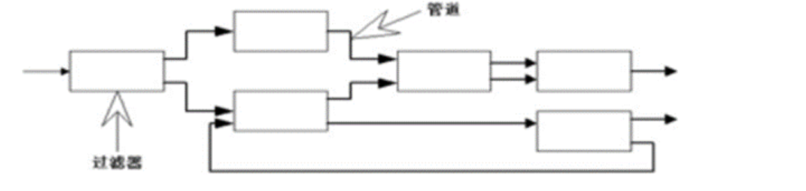

## 管道过滤器风格
管道过滤器风格，由管道和过滤器两部分组成。如下图所示：

管道和过滤器

* 过滤器：是其中的核心构件，负责业务的处理。它从用户或者上游管道获得输入数据，进行数据的变换及增量计算，处理完成后，通过下游管道传递给另一个过滤器。过滤器是独立的实体，它不能与其他的过滤器共享数据，而且一个过滤器不知道它上游和下游的其他过滤器信息。
* 管道：是一种数据传输途径。可以是Unix/Linux操作系统的管道文件，也可以是消息队列，只要能确保数据的先进先出，单向进出就可以了。

## N皇后问题
### 分析
N皇后问题是一个经典的回溯问题，需要找出所有可能的解。在这个问题中，我们需要在一个NxN的棋盘上放置N个皇后，使得任何两个皇后都不在同一行、同一列或同一对角线上。我们可以使用管道过滤器风格来解决这个问题，其中，过滤器负责生成所有可能的棋盘配置，管道负责将这些配置传递给下一个过滤器进行验证。
### 设计
我们可以设计两个过滤器：一个用于生成所有可能的棋盘配置，另一个用于验证这些配置是否有效。管道则负责将生成的配置从第一个过滤器传递到第二个过滤器。
### 实现
首先，我们需要一个函数来生成所有可能的棋盘配置。这个函数可以使用递归的方式，在每一行尝试放置一个皇后，然后递归地在下一行中放置皇后。如果我们已经在所有的行中都放置了皇后，那么我们就找到了一个可能的配置。

然后，我们需要一个函数来验证一个给定的配置是否有效。这个函数可以遍历棋盘，检查任何两个皇后是否在同一行、同一列或同一对角线上。

最后，我们需要一个管道来连接这两个过滤器。管道可以是一个简单的数据结构，如队列，它从第一个过滤器接收生成的配置，然后将它们传递给第二个过滤器进行验证。
